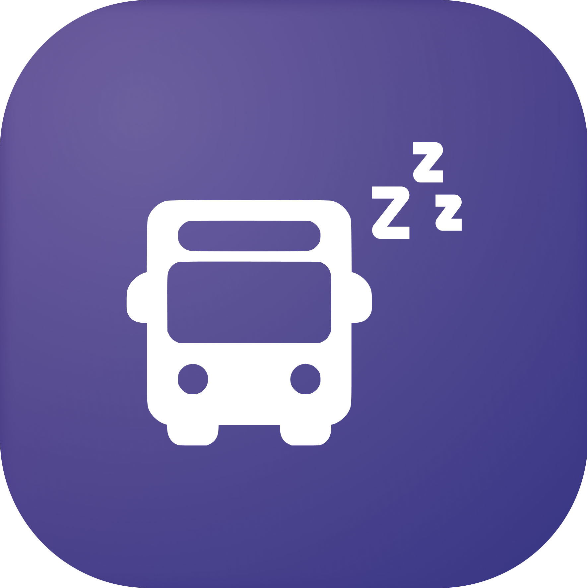

  

 <h1 align="center"> שנ״צ בתחב״צ - להתעורר בתחנה. </h1>

  

  

## הקדמה

האם אי פעם רצית לנמנם בתחבורה ציבורית מבלי לבזבז מחשבות על מתי לצאת? שעון מעורר לפי מיקום הוא הפתרון עבורכם. פשוט הגדר\י את תחנת תחבורה הציבורית במקום שבו תרצה\י שיעירו אותך או שתפו מ- Moovit - שנ"צ בתחב"צ יעשה את כל השאר!

## פיצ׳רים

- תנומה ללא טרחה - הגדר את המיקום שלך, תנומה במעבר ותן ל-שנ"צ בתחב"צ להעיר אותך בזמן.
- הגדרה פשוטה - ממשק ידידותי למשתמש להפעלת התראות.
- אינטגרציה עם Moovit - שיתוף המסלול מMoovit לשנ"צ בתחב"צ ישים אוטומטית שעון מעורר לתחנות בהם אתם יורדים.
- התאמה אישית - בחר צלילי אזעקה, עוצמת קול ודפוסי רטט שיתאימו להעדפותיך.
<!-- 

 

 -->

## פידבק

נשמח לשמוע ולקבל את כל חוות הדעת שיש לך על האפליקציה - באגים או תקלות, קשיים בשימוש או חוסר נוחות, כמו כן כל הצעה לשיפור ופיצ׳ר שחסר והיית שמח שנוסיף תתקבל בברכה ובאוזן קשבת, לשם כך תוכלו לפנות אלינו לכתובת:
shnatz.bus@gmail.com
מבטיחים לענות מהר ככל הניתן.

## תודות

הפרויקט הוקם ומפותח על ידי [דולב פרנקו](https://github.com/dtkdt100/) ו[עידו שרון](https://github.com/idosharon). 

